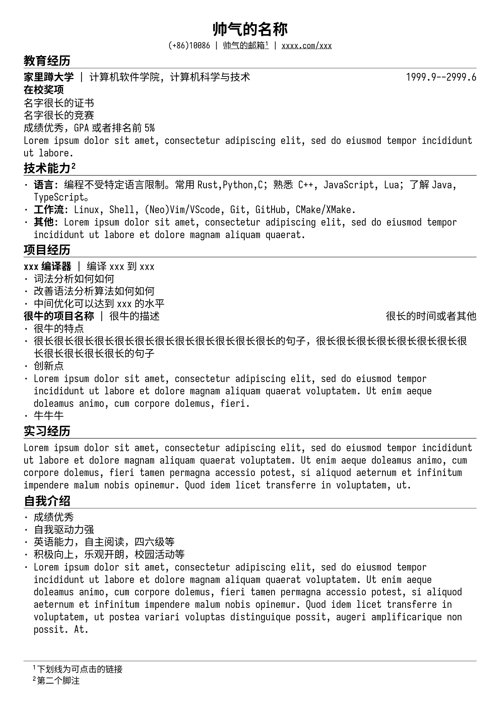
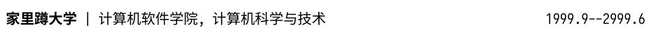

# tyst-resume

This is resume template.

Simple and concise.

## How to use

download [font](https://github.com/laishulu/Sarasa-Term-SC-Nerd)

`git clone` or download zip

change test.typ

## functions

### title

Adding underline for this title and some general features, like this

### subtitle

It have `main_title`, `sub_title` and `describtion`(left to right).

### resume

Set page, bar, text and so on.

`Heading(level: 1)` and `title` are the same from apperance.

`Heading(level: 2)` like `subtile` withnot `sub_title` and `description` from apperance.

Add an underline to the `link`.

# Thinks

source of inspiration [resume-ng](https://github.com/fky2015/resume-ng)